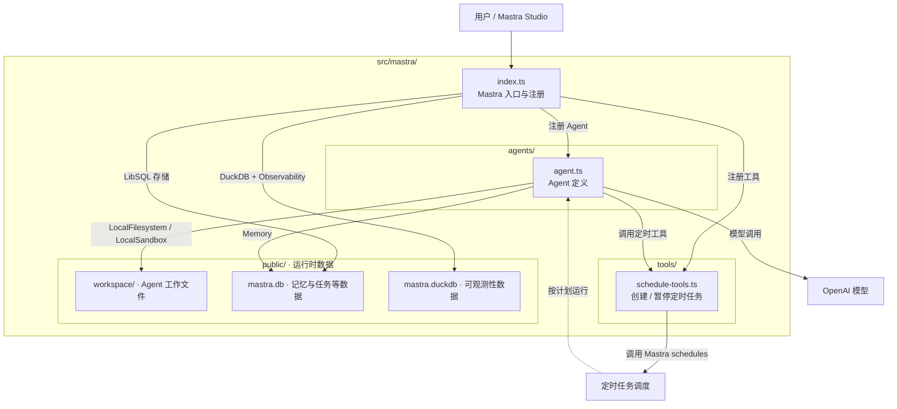

下面是按**当前实际目录**整理的架构图。核心源码集中在 `src/mastra/` 下的 3 个文件。

| 目录或文件 | 作用 |
|---|---|
| [src/mastra/index.ts](/Users/nerosun/裂缝中的阳光/sxy/日常/code/nerosun-harness/nero-agent/src/mastra/index.ts) | 注册 Agent 和工具；配置 LibSQL、DuckDB 与可观测性。 |
| [src/mastra/agents/agent.ts](/Users/nerosun/裂缝中的阳光/sxy/日常/code/nerosun-harness/nero-agent/src/mastra/agents/agent.ts) | 配置模型、记忆、工作区、内置网络工具及定时工具。 |
| [src/mastra/tools/schedule-tools.ts](/Users/nerosun/裂缝中的阳光/sxy/日常/code/nerosun-harness/nero-agent/src/mastra/tools/schedule-tools.ts) | 实现 `start_schedule` 和 `stop_schedule`。 |
| `src/mastra/public/` | 本地运行时数据；`workspace/` 会在使用时创建。 |
| `.mastra/` | Mastra 构建和开发运行时生成目录，不是业务源码。 |

启动入口是 `package.json` 的 `npm run dev`；目前项目没有单独的工作流或前端业务源码。